# DNS Seeder Setup Guide

The process of setting up a DNS seeder for use with a blockchain network includes two main components:

1. DNS setup: This can be done using one of two methods: The original [Local DNS Server Setup](#local-dns-server-setup) method or the newer [Cloudflare Setup](#cloudflare-setup) method.
2. Application configuration: This involves searching through the source code for the target blockchain project you wish to run a DNS seeder for and plugging the correct values into a config file.

**NOTE:** If you would just like to crawl a particular blockchain network to get a list of all connectable nodes, you can skip the whole DNS Setup and need for purchasing a domain name and just configure the seeder app by following the [Seeder App Configuration](#seeder-app-configuration) section only.

## Table of Contents

- [Local DNS Server Setup](#local-dns-server-setup)
- [Cloudflare Setup](#cloudflare-setup)
- [Seeder App Configuration](#seeder-app-configuration)
- [Tips & Troubleshooting](#tips--troubleshooting)

## Local DNS Server Setup

In this section you will learn how to create a basic DNS server using the DNS seeder app which listens for DNS requests and serves results based on the IP addresses that have been crawled on your blockchain network. The steps provided make use of a domain name purchased from https://namecheap.com which is just a sample of one of the many domain registrars that could be used to do this set up. You can alternatively skip this section and set up your DNS seeder using a free Cloudflare account by following the instructions in the [Cloudflare Setup](#cloudflare-setup) section.

#### Prerequisites

1. You will need control of a top-level domain (TLD) that allows administrator access for the purposes of creating additional DNS entries. Any domain registrar should be OK to use. **Ex:** godaddy.com, register.com, hostgator.com, etc.

#### Detailed Local DNS Server Setup Instructions

1. While it may be possible to use an existing domain for this set up, it is recommended to register a new domain name that will be used to run the DNS seeder address. A domain from https://namecheap.com will be used for this example.
2. Log into your domain registrar and navigate to the section where you can manage DNS records for your domain. Locate the button or mechanism to create a new DNS record and click/activate it.
   
   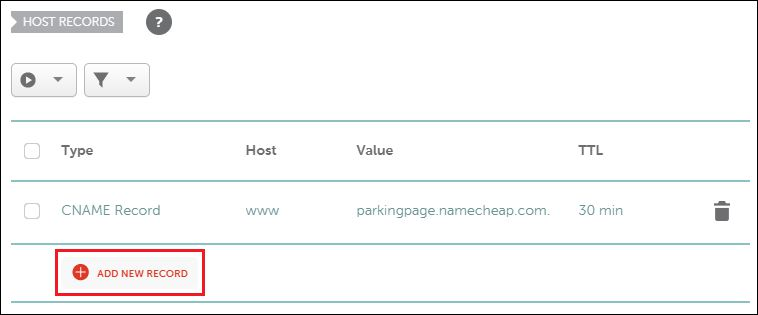
3. Create a new DNS record using the following settings, and then save the record:

   **Type:** "A" Record<br />
   **Name/Host:** (Any domain prefix can go here as long as you match it to the value from step 4. **Ex:** vps)<br />
   **Value:** (The IP address of the server where your DNS seeder app will be running. **Ex:** 125.128.221.118)<br />
   **TTL:** 24 Hours (86400) (If there is some kind of default option such as 'Automatic', you can select that instead)

   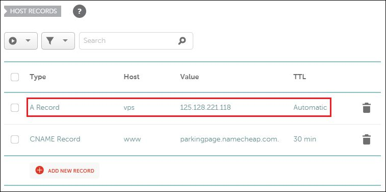
4. Create another new DNS record using the following settings, and then save the record:

   **Type:** NS Record<br />
   **Name/Host:** (Any domain prefix can go here as long as you match it to the host value used in the [Seeder App Configuration](#seeder-app-configuration) section. **Ex:** dnsseed)<br />
   **Value/Nameserver:** (The fully qualified "A" record that was created in step 3. **Ex:** vps.example.com)<br />
   **TTL:** 24 Hours (86400) (If there is some kind of default option such as 'Automatic', you can select that instead)

   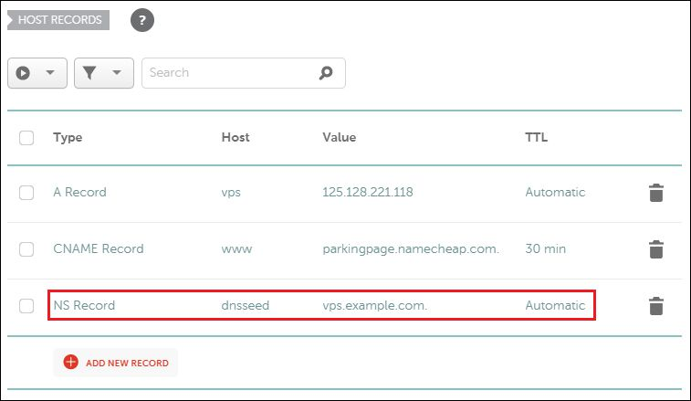

   **NOTE:** Do not worry about waiting for these DNS settings to propagate now, as they won't finish propagating until after the DNS seeder app is configured and running. The DNS seeder app will create a lightweight DNS server which will automatically connect the DNS entries together for you.

5. That's it for the Local DNS Server Setup! You can now skip to the [Seeder App Configuration](#seeder-app-configuration) section to finish the application installation.

## Cloudflare Setup

Instead of using the DNS seeder app to run your own DNS server, this section utilizes a free Cloudflare account to host the list of good nodes from your blockchain network. If you have already completed the [Local DNS Server Setup](#local-dns-server-setup) then you can skip this section, as it is only an alternative method to accomplish a similar result.

#### Prerequisites

1. You will need control of a top-level domain (TLD) that allows administrator access for the purposes of creating additional DNS entries and changing default nameservers. Any domain registrar should be OK to use. **Ex:** godaddy.com, register.com, hostgator.com, etc.

#### Detailed Cloudflare Instructions

1. While it may be possible to use an existing domain for this set up, it is recommended to register a new domain name that will be used to run the DNS seeder address. A domain from https://namecheap.com will be used for this example.
2. Navigate to https://dash.cloudflare.com/sign-up to create a new Cloudflare account. Enter your email address, set a new password, and click the "Create Account" button.

   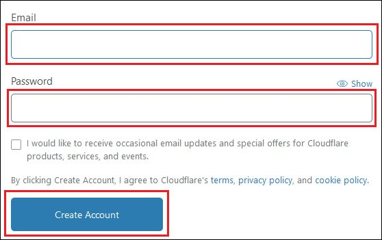
3. Be sure to check your email and click the activation link to unlock your account.

   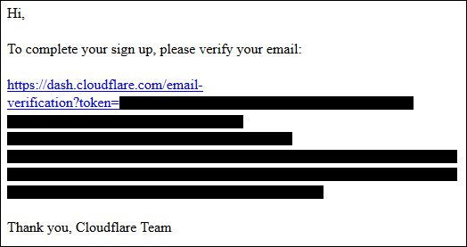
   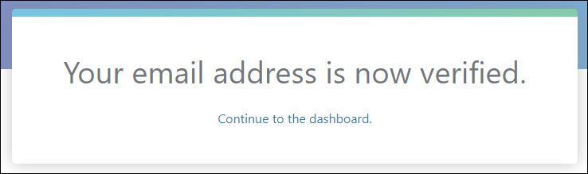
4. Continuing with the Cloudflare setup, it will ask you to add a site. Go ahead and enter the base domain name that you have purchased to set up for the seeder (**Ex:** example.com) and click the "Add Site" button.

   
5. Choose the free plan, as there really isn't much benefit to choosing a paid plan for DNS seeder use. Click the "Confirm plan" button to continue.

   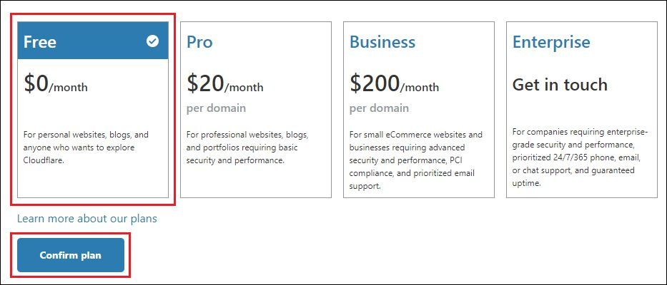
6. The "Review your DNS records" screen shows your existing DNS setup for your domain and can be skipped for now by clicking the "Continue" button.

   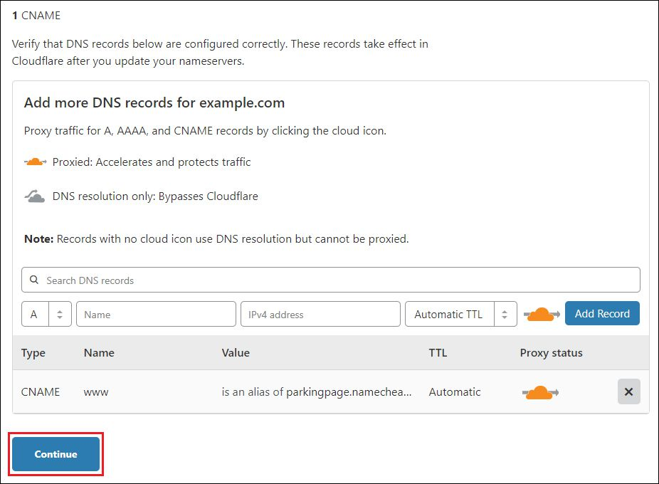
7. The final screen shows basic instructions for changing your existing nameservers over to Cloudflare servers. Be sure to complete the next step below before clicking the "Done, check nameservers" button.

   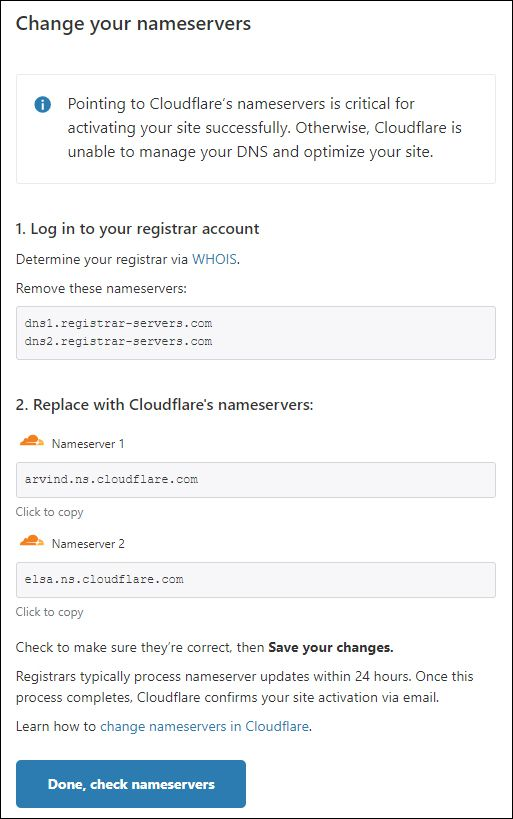
8. Log into your domain registrar website and update the nameservers for your DNS seeder domain (using namecheap.com as a sample registrar in this case - your domain registrar will have a similar but different screen for changing the nameservers).

   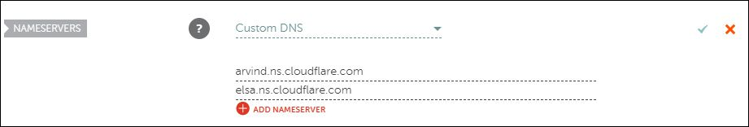
9. After updating your domains nameservers, you can click the "Done, check nameservers" button to return to the Cloudflare dashboard. You will need to wait for 1-48 hours for the propagation of the new nameservers to complete. An email will be sent to you from Cloudflare once they notice it is activated on their end, and you can also see a success msg in the Cloudflare dashboard once propagation has finished as well.

   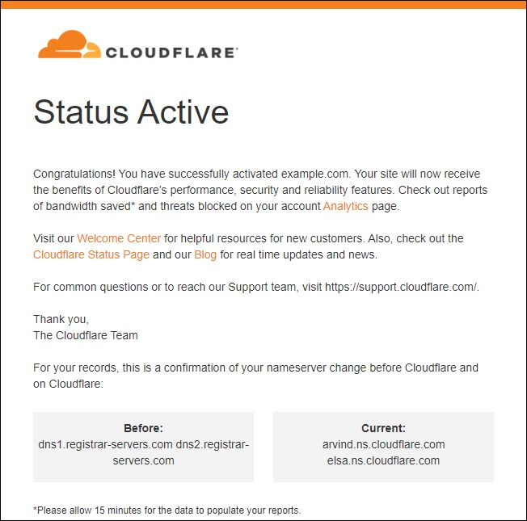
   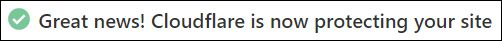
10. That's it for the Cloudflare Setup! You can now move to the [Seeder App Configuration](#seeder-app-configuration) section to finish the application installation.   

## Seeder App Configuration

This section must be completed on a computer running the Linux operating system. Instructions for Debian/Ubuntu are provided below, but other Linux distros should be possible as long as boost and ssl are installed.

#### Prerequisites

1. If you are going to be linking the DNS seeder app to a DNS entry, you must have already purchased a domain name and created the necessary DNS entries as described above.
2. A Debian/Ubuntu server to host the DNS seeder app.
3. If you are using the [Local DNS Server Setup](#local-dns-server-setup) then you must either run the seeder app with root privileges, or else there will be an extra step to redirect the internal port number.

#### Detailed Seeder App Instructions

1. Install the dependencies for the DNS seeder app by running the following cmd in the terminal:

   `sudo apt-get install build-essential libboost-all-dev libssl-dev libcurl4-openssl-dev libconfig++-dev`
   
2. **ONLY COMPLETE THIS STEP IF YOU ARE SETTING UP THE SEEDER FOR USE WITH CLOUDFLARE, OTHERWISE YOU MAY SKIP THIS STEP.**<br /><br />
   Extra setup is required before CloudFlare mode will work properly. Python 3+ and the Cloudflare Python API must be installed. Run the following cmds in the terminal, one line at a time:

```
sudo apt-get install python3 python3-pip
sudo pip3 install cloudflare
```   
   
3. Download the latest copy of the generic DNS seeder app by running the following cmd in the terminal:

   `git clone https://github.com/team-exor/generic-seeder.git`
4. Navigate to the newly downloaded DNS seeder app directory by running the following cmd in the terminal:

   `cd generic-seeder`
5. Create a default configuration file by running the following cmd in the terminal:

   `cp ./settings.conf.template ./settings.conf`
6. Open the configuration file using the nano editor by running the following cmd in the terminal:

   `nano settings.conf`
7. Using the arrow keys on the keyboard to move around, fill in all the necessary values in the configuration file and press CTRL+X, then Y (for yes to save) and then ENTER to save the changes to the config. **NOTE:** All config values must be surrounded by double-quotes or else the configuration will be deemed invalid.

##### Extra details about each specific config settings:

- **protocol_version (Required):** This is the current protocol version that should be used by the seeder app to crawl your network and connect to other nodes. **Ex:** 70015. Typically you can find the protocol version in your coins `version.h` file.
- **init_proto_version (Required):** This is the protocol version that should be used as a starting value to communicate with nodes on the blockchain. **Ex:** 209. Typically you can find the init protocol version in your coins `version.h` file.
- **min_peer_proto_version (Optional):** This is the oldest/lowest protocol version that is allowed to communicate with nodes on the blockchain network. **Ex:** 70015. Typically you can find the minimum peer protocol version in your coins `version.h` file. Leave this value blank or set it to the same value as `protocol_version` if this setting does not exist in your blockchain.
- **caddr_time_version (Required):** This is the nTime value that is used to serialize CAddress data for the blockchain. **Ex:** 31402. Typically you can find the `caddr_time_version` in your coins `version.h` file.
- **pchMessageStart_0 (Required):** The first byte of the "magic bytes" that are unique to the blockchain you are configuring. Must be prefixed with 0x followed by the two digits to make up the full byte. **Ex:** 0x11. Typically you can find the 4 pchMessageStart values in your coins `main.cpp` or `chainparams.cpp` file.
- **pchMessageStart_1 (Required):** The second byte of the "magic bytes" that are unique to the blockchain you are configuring. Must be prefixed with 0x followed by the two digits to make up the full byte. **Ex:** 0x22. Typically you can find the 4 pchMessageStart values in your coins `main.cpp` or `chainparams.cpp` file.
- **pchMessageStart_2 (Required):** The third byte of the "magic bytes" that are unique to the blockchain you are configuring. Must be prefixed with 0x followed by the two digits to make up the full byte. **Ex:** 0x33. Typically you can find the 4 pchMessageStart values in your coins `main.cpp` or `chainparams.cpp` file.
- **pchMessageStart_3 (Required):** The fourth byte of the "magic bytes" that are unique to the blockchain you are configuring. Must be prefixed with 0x followed by the two digits to make up the full byte. **Ex:** 0x44. Typically you can find the 4 pchMessageStart values in your coins `main.cpp` or `chainparams.cpp` file.
- **wallet_port (Required):** The main port # that is used to connect to the wallets in your blockchain. **Ex:** 12345. This is **NOT** the rpc port #.
- **explorer_url (Optional):** The url to a block explorer api that returns the current block height for your blockchain. **Ex:** [https://explorer.example.com/api/getblockcount](https://explorer.example.com/api/getblockcount). If this value is set to a valid block explorer api url, then the current block is fetched from the block explorer api once every x seconds based on the `explorer_requery_seconds` value. Leaving this value blank will cause nodes to be validated against the hardcoded `block_count` number below to determine whether a node is considered "good" or not based on if the nodes current block is above or below the currently known block height value.
- **second_explorer_url (Optional):** An alternate url to a block explorer api that returns the current block height for your blockchain. If both `explorer_url` and `second_explorer_url` are set to valid block explorer api urls, then the 1st `explorer_url` will be contacted. If for any reason the 1st api does not return a valid block count, or if the block count hasn't changed since the last check, then the 2nd explorer url is used as a backup.
- **explorer_requery_seconds (Required only if `explorer_url` or `second_explorer_url` is set):** Used in conjunction with the `explorer_url` and `second_explorer_url` parameters. This represents the total amount of time to wait in seconds before re-getting the current block height value from the block explorer api url. Typically it is recommended to set this value to the average amount of seconds that your blockchain takes to find a new block.
- **block_count (Required):** This value represents the lowest block height that will be allowed for any node to be considered a "good" node. If either the `explorer_url` or `second_explorer_url` options are set, then this `block_count` value will be continuously reset to the value returned from the last contacted explorer api.
- **seed_1 (Required):** The 1st hardcoded ip address or domain to connect to. Because blockchains are decentralized, providing the address to a single node on the network is required here for gaining access to more peers on the blockchain. This can simply be an IP address of any node on the blockchain network that you are trying to crawl, or it can be the address to another DNS seeder instance that will return multiple node addresses.
- **seed_2 (Optional):** The 2nd hardcoded ip address or domain to connect to. This is optional because only one seed node address is required to gain access to the whole blockchain.
- **seed_3 (Optional):** The 3rd hardcoded ip address or domain to connect to. This is optional because only one seed node address is required to gain access to the whole blockchain.
- **seed_4 (Optional):** The 4th hardcoded ip address or domain to connect to. This is optional because only one seed node address is required to gain access to the whole blockchain.
- **seed_5 (Optional):** The 5th hardcoded ip address or domain to connect to. This is optional because only one seed node address is required to gain access to the whole blockchain.
- **seed_6 (Optional):** The 6th hardcoded ip address or domain to connect to. This is optional because only one seed node address is required to gain access to the whole blockchain.
- **seed_7 (Optional):** The 7th hardcoded ip address or domain to connect to. This is optional because only one seed node address is required to gain access to the whole blockchain.
- **seed_8 (Optional):** The 8th hardcoded ip address or domain to connect to. This is optional because only one seed node address is required to gain access to the whole blockchain.
- **seed_9 (Optional):** The 9th hardcoded ip address or domain to connect to. This is optional because only one seed node address is required to gain access to the whole blockchain.
- **seed_10 (Optional):** The 10th hardcoded ip address or domain to connect to. This is optional because only one seed node address is required to gain access to the whole blockchain.
- **cf_domain (Optional):** The domain name that you want to configure for use with Cloudflare and the DNS seeder app. **Ex:** example.com. This value is only required if you followed the [Cloudflare Setup](#cloudflare-setup).
- **cf_domain_prefix (Optional):** The domain name prefix for the NS record that is configured for use with Cloudflare and the DNS seeder app. **Ex:** dnsseed. This value is only required if you followed the [Cloudflare Setup](#cloudflare-setup).
- **cf_username (Optional):** The username (usually an email address) for the Cloudflare account that is configured for use with the DNS seeder app. **Ex:** email@example.com. This value is only required if you followed the [Cloudflare Setup](#cloudflare-setup).
- **cf_api_key (Optional):** The API key for the Cloudflare account that is configured for use with the DNS seeder app. You can find this value by logging into your Cloudflare account, clicking on the domain you have configured for the DNS seeder, ensure you are on the Overview tab and scroll down to find and click on a link called "Get your API token". Open the "API Tokens" tab, then click the "View" button next to the "Global API Key" and enter your password to gain access to your API key. **Ex:** 4f387a3b17d9efde484951fb372dbcb2. This value is only required if you followed the [Cloudflare Setup](#cloudflare-setup).
- **cf_seed_dump (Optional):** The name of the dump file with the list of "good" nodes that the Cloudflare script should look for. For now, this should always be set to `dnsseed.dump`, but may need to be changed in the future for more advanced setups. This value is only required if you followed the [Cloudflare Setup](#cloudflare-setup).

8. Compile the DNS seeder app by running the following cmd in the terminal:

   `make`
9. At this point everything should be ready to run the DNS seeder app. If you followed the [Cloudflare Setup](#cloudflare-setup) or if you would just like to crawl the blockchain network to get a list of all connectable nodes, you can run the DNS seeder app without any arguments like this:

   `./dnsseed`

   If you followed the [Local DNS Server Setup](#local-dns-server-setup) then you must additionally run the app with root privileges, and specify a few extra arguments like this:

   `sudo ./dnsseed -h dnsseed.example.com -n vps.example.com -m test@example.com`

   **dnsseed.example.com (Required):** the NS record that you created in step 4 of the [Local DNS Server Setup](#local-dns-server-setup).<br />
   **vps.example.com (Required):** the "A" record that you created in step 3 of the [Local DNS Server Setup](#local-dns-server-setup).<br />
   **test@example.com (Optional):** the email address that the DNS server will use to report SOA records.

   **NOTE 1:** If using the [Local DNS Server Setup](#local-dns-server-setup) method, port 53 must be open and available to the public internet for this process to work properly. If you are behind a firewall, you will need to open port 53 before your DNS seeder will properly respond to DNS requests. If you are already running another DNS server or some other application is already using port 53, you will need to run this software on another server.
   
   **NOTE 2:** If using the [Local DNS Server Setup](#local-dns-server-setup) method, and you are unable to always run the DNS seeder app with root privileges, you can skip to step 11 for an alternate method that requires root privileges one time only.

10. **ONLY COMPLETE THIS STEP IF YOU ARE SETTING UP THE SEEDER FOR USE WITH CLOUDFLARE, OTHERWISE YOU MAY SKIP THIS STEP.**<br /><br />
   An extra step is required for taking the "good" list of nodes from the DNS seeder app and sending it to Cloudflare. To do this manually you can run the following cmd in the terminal:<br /><br />
   `cd /path/to/seeder/cf-uploader && python3 seeder.py`<br /><br />
   Change `/path/to/seeder/` so that it matches the location of where you installed the DNS Seeder app. After running this cmd, if everything went well and is working, you should be able to immediately run the following cmd in a terminal window and see results (Be sure to change `dnsseed.example.com` to your fully qualified NS record):<br /><br />
   `nslookup dnsseed.example.com`<br /><br />
   The IP addresses that are returned from the `nslookup` cmd are coming from your `dnsseed.dump` file, so you can always double-check by cross-referencing some of the IP addresses in both places.<br /><br />
   Once you are sure that everything is working, it is recommended to set up a cron job that will automatically update the seeds list every 30 minutes or so by running the following cmd in a terminal:<br /><br />
   `crontab -e`<br /><br />
   Then add this line to the bottom of the crontab file that opens up (Be sure to change the `/path/to/seeder/` part so it matches the location of where you installed the DNS Seeder app):<br /><br />
   `*/30 * * * * cd /path/to/seeder/cf-uploader && python3 seeder.py`

11. **ONLY COMPLETE THIS STEP IF YOU ARE SETTING UP THE SEEDER USING THE [LOCAL DNS SERVER SETUP](#local-dns-server-setup) METHOD AND DO NOT WANT TO ALWAYS HAVE TO RUN THE SEEDER APP AS THE ROOT USER, OTHERWISE YOU MAY SKIP THIS STEP.**<br /><br />
   Because non-root users cannot access ports below 1024, an extra step is required to allow you to run the DNS server (which must always use port 53) without root privileges. The easiest way to do this is by running the following cmd in the terminal (this one-time cmd requires root privileges to execute successfully):<br /><br />
   `sudo iptables -t nat -A PREROUTING -p udp --dport 53 -j REDIRECT --to-port 5353`<br /><br />
   Now, when starting the DNS seeder app, you must always specify the redirected port using the `-p` argument:<br /><br />
   `./dnsseed -h dnsseed.example.com -n vps.example.com -m test@example.com -p 5353`<br /><br />
   **NOTE:** The redirected port 5353 must be open and available to the public internet for this process to work properly. If you are behind a firewall, you will need to open port 5353 before your DNS seeder will properly respond to DNS requests.

12. That's it for the Seeder App Configuration! Be sure to read the extra troubleshooting notes below if you have any problems.

## Tips & Troubleshooting

- While running the DNS seeder app, the total "good" nodes vs total nodes will increase as more nodes are found. If after a few minutes your seeder app is still showing `0/x available` then most likely you have a configuration problem and are not properly connected to the chosen blockchain network. Stop the app with CTRL+C and double-check your settings with `nano settings.conf` and try again.
- After running the DNS seeder app for a few minutes, a `dnsseed.dump` file will be created in the same directory as the seeder app. If you open this file using a text editor, you will see a list of all nodes that the seeder app has crawled along with stats about their status, uptime, current block, etc. Only the IP addresses of "good" nodes will be shared back to your DNS server, so be sure to look at the "good" column value (1 = good, 0 = bad). You can always check the `dnsseed.dump` file for an updated look at how many nodes are on your blockchain network and the status of each.
- If everything is working correctly, you can see a list of "good" IP addresses by running the cmd `nslookup dnsseed.example.com` (Replace `dnsseed.example.com` with your NS record). Please keep in mind that these results can be cached, and even after everything is working you may still continue seeing the same invalid results. You can always try testing from multiple computers or else you can use an online service such as https://www.whatsmydns.net/#A/dnsseed.example.com for example.

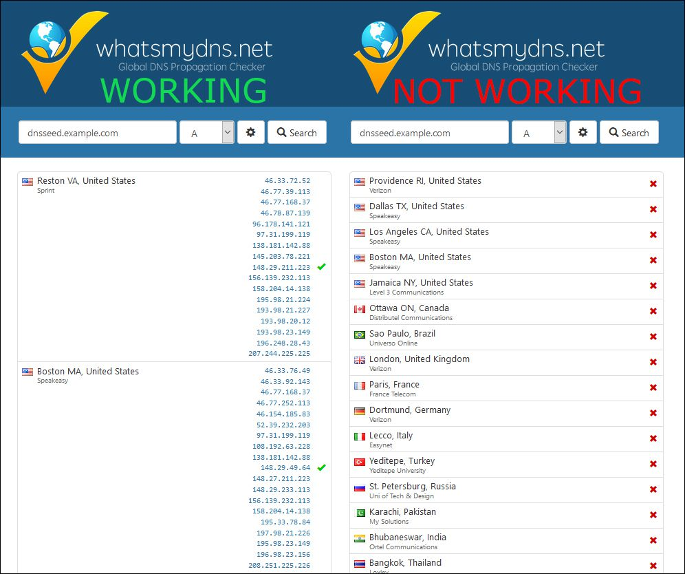